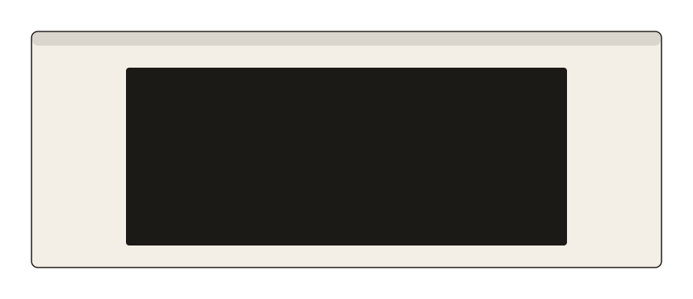

<p align="center">
  <picture>
    <source media="(prefers-color-scheme: dark)" srcset="logo-dark.svg">
    
  </picture>
</p>

<h1 align="center">Ichi</h1>

<p align="center"><em>One window, room to breathe.</em></p>

<p align="center">
  <picture>
    <source media="(prefers-color-scheme: dark)" srcset="demo-dark.svg">
    
  </picture>
</p>

Ichi is for the workspaces where you keep a single window — a terminal, a
note, a chat — and that window doesn't need the whole screen. The behaviour is
one Lua file any Hyprland session can load; on Omarchy it installs as a plugin,
with a bar widget, a command line and optional menu entries.

- **One key, one workspace.** `SUPER+CTRL+ALT+I` insets the lone window on the
  workspace you're on. Every other workspace is left alone.
- **Sized by feel.** Arrow keys nudge width and height, and hold to keep
  going. When it looks right, `adopt` makes that the default.
- **Never in the way.** Open a second window and the inset disappears. Close
  it and the inset comes back.
- **Plain state.** One JSON file you can read, edit and keep in your dotfiles.

Needs Hyprland 0.55 or newer, configured in Lua. The bar widget, the menu
entries and the `omarchy-shell ichi` commands need Omarchy 4.x; everything
else is the Lua file. No compiled component, no daemon, no network access. Built and tested
against Hyprland 0.56.2 on Omarchy 4.0.2.

## Install

```bash
omarchy plugin add https://github.com/aesko/omarchy-ichi --enable
```

You are asked which bar section to put the widget in. On first run Ichi
appends one guarded line to `~/.config/hypr/hyprland.lua` that loads
`ichi.lua`, and tells you it did. Nothing is inset until you turn a workspace
on, so installing changes nothing about how your desktop tiles.

`hyprland.lua` is often a symlink into a dotfiles repo, and Ichi follows it —
but only after checking that every step of that symlink, and every directory
above it up to your home directory, belongs to you. If that check fails (for
example, `hyprland.lua` resolves to a path outside your home directory, as a
Nix or home-manager–managed config typically does), Ichi leaves the file
alone and tells you so instead of writing through it; add the loader block
from [Without Omarchy](#without-omarchy) by hand in that case, then run
`omarchy-shell ichi sync` once it is in place.

The edit itself replaces the file rather than rewriting it in place: the new
text is written alongside and renamed over the old one, so an interrupted
install leaves your `hyprland.lua` as it was rather than empty. A symlink
pointing at it still points at it afterwards. A *hard* link to the same file
does not — that copy keeps the old text.

To update:

```bash
omarchy plugin update io.github.aesko.ichi
omarchy restart shell
hyprctl reload
```

The shell keeps running the old service, and Hyprland the old `ichi.lua`,
until each is reloaded. Your settings file is read as it is; see
[CHANGELOG.md](CHANGELOG.md) for what each version adds.

### Without Omarchy

`ichi.lua` is the whole behaviour and needs nothing but Hyprland. Clone the
repository and load the file from your `hyprland.lua` — the line the plugin
would have written for you:

```bash
git clone https://github.com/aesko/omarchy-ichi ~/.local/share/ichi
```

```lua
-- ~/.config/hypr/hyprland.lua
do
  local p = os.getenv("HOME") .. "/.local/share/ichi/ichi.lua"
  local f = io.open(p, "r"); if f then f:close(); dofile(p) end
end
```

`hyprctl reload` picks it up. Write the keybindings below with Hyprland's own
`hl.bind` in place of Omarchy's `o.bind` helper. The description moves into
the options table, next to `repeating` where a binding has it:

```lua
hl.bind("SUPER + CTRL + ALT + I", function()
  if ichi then ichi.toggle() end
end, { description = "Ichi: toggle" })
```

The actions — toggle, nudge, presets, `set` and the rest — are Lua functions
you can call from a shell with `hyprctl eval 'ichi.toggle()'`; the list is in
[docs/reference.md](docs/reference.md#from-lua). `hyprctl eval` prints
nothing back, so the status queries stay behind on Omarchy. To update:

```bash
git -C ~/.local/share/ichi pull
hyprctl reload
```

A config still on `hyprland.conf` has nowhere to load the file from; moving
to Lua is the way in, and `example/hyprland.lua` in Hyprland's repository is
a starting point.

The bar widget, the menu entries and the `omarchy-shell ichi` commands stay
behind on Omarchy; notifications go through `notify-send`. State lives in
`~/.config/ichi/ichi.json`; to keep it elsewhere, set `ichi.config_path` after
the `dofile` line and call `ichi.load()`.

## Keybindings

Plugins cannot install bindings, so add these to `~/.config/hypr/bindings.lua`.
They are guarded, so the config stays valid if the plugin is removed.
`SUPER+CTRL+ALT+Z` is avoided because Omarchy binds it to zoom reset, and
`SUPER+ALT+arrows` because Omarchy moves windows between groups with those.

```lua
-- Ichi (io.github.aesko.ichi)
o.bind("SUPER + CTRL + ALT + I", "Ichi: toggle", function()
  if ichi then ichi.toggle() end
end)
o.bind("SUPER + CTRL + ALT + O", "Ichi: reset to default", function()
  if ichi then ichi.reset() end
end)
o.bind("SUPER + CTRL + ALT + P", "Ichi: next preset", function()
  if ichi then ichi.cycle() end
end)
o.bind("SUPER + CTRL + ALT + A", "Ichi: adopt as default", function()
  if ichi then ichi.adopt_defaults() end
end)
for key, dw, dh, word in ("LEFT,-1,0,narrower RIGHT,1,0,wider UP,0,1,taller DOWN,0,-1,shorter"):gmatch("(%a+),(-?%d),(-?%d),(%a+)") do
  o.bind("SUPER + CTRL + ALT + " .. key, "Ichi: " .. word, function()
    if ichi then ichi.nudge(tonumber(dw), tonumber(dh)) end
  end, { repeating = true })
  o.bind("SUPER + CTRL + ALT + SHIFT + " .. key, "Ichi: " .. word .. " (fine)", function()
    if ichi then ichi.nudge(tonumber(dw), tonumber(dh), true) end
  end, { repeating = true })
end
```

Every binding acts on the workspace you are on. Nudging a workspace that is
off turns it on. The plain arrows move by `step` (5 points) and the shifted
ones by `fine_step` (1 point). The quickest way to a default you like: turn a
workspace on, tune it with the arrows, then press adopt.

Keep the `Ichi:` prefix on the descriptions. The panel's shortcut list matches
on it, and a Lua bind gives Hyprland nothing else to match — it reports an
opaque `__lua` dispatcher, so your description is the only link between a key
and what it does. Four arrows under the same modifiers, described alike but for
the direction, show there as a single *resize* row.

## Bar widget

One glyph, dimmed on a workspace where Ichi is off. **Left click opens the
panel, right click toggles this workspace**, matching Omarchy's audio,
bluetooth and power widgets. The panel holds the on/off switch, a row of
sizes — the defaults first, then your presets — width and height as a typed
field and a slider, adopt, and the global pause. `+` saves the current size as
a preset; right-clicking one removes it. The controls stay live on a workspace
that is off, showing what it would get; touching one turns it on.

Under the sizes is a row of aspect ratios — 16:9, 16:10, 3:2, 4:3 and 1:1.
Picking one switches this workspace to that shape, which is why the sliders
stand down for it; `default` or a preset brings them back. Any other ratio is
`omarchy-shell ichi aspect 21 9`.

The cog turns the panel over. On the back are the widget's own settings — what
it shows in the bar and what left click does — then Ichi's notifications and
its resize step and fine step, and a list of your Ichi keybindings, read from
`hyprctl binds`.

`omarchy-shell ichi.panel toggle` opens the panel, so you can bind it to a key.

To move the widget, `omarchy plugin enable io.github.aesko.ichi --section
center`. Two settings are only reachable from the command line — keeping Ichi
without the widget, and showing the icon only on workspaces where Ichi is on:

```bash
omarchy bar set io.github.aesko.ichi display Hidden
omarchy bar set io.github.aesko.ichi showWhenOff false --json
```

Upgrading from 0.3 or earlier is the one case where the widget does not appear
on its own — your config already lists the plugin as enabled, so Omarchy sees
nothing to place. Disable and enable it once:

```bash
omarchy plugin disable io.github.aesko.ichi
omarchy plugin enable io.github.aesko.ichi --section right
```

## Command line

```bash
omarchy-shell ichi help           # every command, grouped
omarchy-shell ichi status         # this workspace and the settings, as text
omarchy-shell ichi toggle
omarchy-shell ichi nudge -1 0     # one step narrower
omarchy-shell ichi size 65 85     # an absolute size for this workspace
omarchy-shell ichi aspect 4 3     # switch this workspace to 4:3
omarchy-shell ichi preset reading
omarchy-shell ichi adopt          # this workspace's size becomes the default
omarchy-shell ichi pause on       # suspend every inset; pause off to resume
omarchy-shell ichi set settings.step 10   # any setting, by its place in the file
```

`status` is written to be read, and leaves out the rows that carry nothing:

```
Workspace   3
Inset       70% x 80% (default)
Default     70% x 80%
Presets     reading, wide
On          2, 3, code
Step        5, fine 1
Notify      changes
```

`status_json` is the same state as JSON, for anything parsing it. Every other
command, the Lua functions behind them, and a set of Omarchy menu entries are
in [docs/reference.md](docs/reference.md).

## Configuration

State lives in `~/.config/ichi/ichi.json`. Edits apply within a second. A
file from before 0.7 at `~/.config/omarchy/ichi.json` is used where it is until
one exists at the new path.

```json
{
  "settings": { "step": 5, "fine_step": 1, "notify": "changes", "max_windows": 1 },
  "defaults": { "width": 70, "height": 80, "max_width": 1800, "align_y": 45 },
  "monitors": { "eDP-1": { "width": 95, "height": 95 } },
  "presets": { "reading": { "mode": "size", "width": 55, "height": 85 } },
  "workspaces": {
    "1": true,
    "2": { "mode": "size", "width": 70, "height": 80 },
    "code": { "mode": "aspect", "ratio": [4, 3] }
  }
}
```

A workspace entry is `true` to follow the defaults, a `size` percentage, or an
`aspect` ratio. Every key is in [docs/reference.md](docs/reference.md).

## How it works

When a workspace you have turned on holds one tiled window, Ichi widens that
workspace's outer gaps so the window takes the share you asked for. A second
tiled window restores the normal gaps; closing it brings the inset back. The
window is never floated, so hibernate, an unplugged monitor or a resolution
change cannot leave it stranded off-screen.

A tabbed group counts as one window, however many it holds. Floating windows
are neither counted nor touched, and special workspaces are ignored. Sizes are
recomputed whenever the monitor arrangement changes.

On a workspace running a layout from a plugin such as
[workspace-layout](https://github.com/bjarneo/omarchy-workspace-layout), Ichi
yields and leaves the gaps alone. The two can run side by side, each on its
own workspaces.

Hyprland's own `layout.single_window_aspect_ratio` — Omarchy's **Toggle →
1-Window Ratio** — compounds with Ichi when both are on: the compositor pads
the window inside the area Ichi has already inset. Ichi warns once when it
sees that. Turn the built-in off and give the workspace an `aspect` entry
instead, for the same shape per workspace.

## Prior art

- **Hyprland's `layout.single_window_aspect_ratio`** is built in and needs
  nothing, but it picks one shape, always maximises it, and applies to every
  workspace or none.
- **[hyprNStack](https://github.com/zakk4223/hyprNStack)** comes closest, with
  `center_single_master` and `single_mfact` — but it replaces your layout, sizes
  width only, is global rather than per workspace, and is a compiled `hyprpm`
  plugin.
- **[pyprland](https://github.com/hyprland-community/pyprland)'s `layout_center`**
  floats one window big over the tiled ones, sized in pixel margins.

## Uninstall

```bash
omarchy plugin remove io.github.aesko.ichi
```

The loader line in `hyprland.lua` checks that `ichi.lua` exists before loading
it, so it is harmless to leave. Remove `~/.config/ichi/` (or, from before 0.7,
`~/.config/omarchy/ichi.json`) to forget the per-workspace settings. Off Omarchy, delete the clone and the block you
added to `hyprland.lua`.

## Development

```bash
git clone https://github.com/aesko/omarchy-ichi
ln -s "$PWD/omarchy-ichi" ~/.config/omarchy/plugins/io.github.aesko.ichi
omarchy plugin enable io.github.aesko.ichi
tests/run.sh
```

`ichi.lua` is the behaviour and runs inside Hyprland. `Model.js` is the pure
shell-side logic, `Service.qml` the glue, `IchiIpc.qml` the IPC surface it
instantiates once per target name, and `BarWidget.qml` the optional widget.
Both pure parts have tests that run without a compositor. `hyprctl reload`
reloads `ichi.lua`; a running service keeps Quickshell's cached component, so
after editing the QML or `Model.js` use `omarchy restart shell`. The demo
animation is generated — edit `gen_demo.py` rather than the SVGs it
overwrites.

## License

MIT
