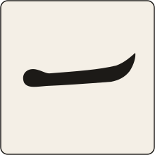

<p align="center">
  
</p>

<h1 align="center">Ichi</h1>

<p align="center"><em>One window, room to breathe.</em></p>

Ichi is an Omarchy plugin for the workspaces where you keep a single window —
a terminal, a note, a chat — and that window doesn't need the whole screen.

- **One key, one workspace.** `SUPER+CTRL+ALT+I` insets the lone window on the
  workspace you're on. Every other workspace is left alone, unless you ask
  for all of them.
- **Sized by feel.** Arrow keys nudge width and height in percentage steps,
  and hold to keep going. When it looks right, `adopt` makes that the default
  for every workspace that has not been tuned by hand.
- **Never in the way.** Open a second window and the inset disappears — the
  space is yours again. Close it and the inset comes back. If you would
  rather a pair shared the box, say so.
- **Stays tiled.** The window is never floated, so hibernate, an unplugged
  monitor or a resolution change can't leave it stranded off-screen.
- **Two ways to size.** A share of the screen (70% × 80%) or an aspect ratio
  (4:3, 1:1) — per workspace, with Hyprland's global 1-Window Ratio absorbed.
- **Plain state.** One JSON file you can read, edit and keep in your dotfiles.
  Edits apply within a second.

## Requirements

| Needs | Why |
| --- | --- |
| Omarchy 4.x (Quattro plugin runtime) | the service is Quickshell QML loaded by `omarchy-shell` |
| Hyprland 0.55 or newer | the Lua config API: `hl.workspace_rule`, `hl.on`, `hl.get_workspace_windows` |
| `hyprctl` on `PATH` | how the shell hands Lua to the compositor |

No compiled component, no daemon, no network access. Built and tested against
Hyprland 0.56.2 on Omarchy 4.0.2.

## Install

```bash
omarchy plugin add https://github.com/aesko/omarchy-ichi --enable
```

On first run the service appends one guarded line to `~/.config/hypr/hyprland.lua`
that loads `ichi.lua`, and tells you it did. Nothing is enabled on any
workspace until you toggle one, so installing changes nothing about how your
desktop tiles.

### Updating

```bash
omarchy plugin update io.github.aesko.ichi
omarchy restart shell
hyprctl reload
```

The update swaps the files, but the shell keeps running the old service and
Hyprland the old `ichi.lua` until each is reloaded. Your settings file is
read as it is; see [CHANGELOG.md](CHANGELOG.md) for what each version adds.

## Keybindings

Plugins cannot install bindings, so add these to `~/.config/hypr/bindings.lua`.
They are guarded, so the config stays valid if the plugin is removed. The
suggested set uses one modifier family throughout; `SUPER+CTRL+ALT+Z` is
avoided because Omarchy binds it to zoom reset, and `SUPER+ALT+arrows` because
Omarchy uses those to move windows between groups.

```lua
-- Ichi (io.github.aesko.ichi)
o.bind("SUPER + CTRL + ALT + I", "Ichi: toggle", function()
  if ichi then ichi.toggle() end
end)
o.bind("SUPER + CTRL + ALT + O", "Ichi: reset size", function()
  if ichi then ichi.reset() end
end)
for key, dw, dh in ("LEFT,-1,0 RIGHT,1,0 UP,0,1 DOWN,0,-1"):gmatch("(%a+),(-?%d),(-?%d)") do
  o.bind("SUPER + CTRL + ALT + " .. key, "Ichi: nudge " .. key:lower(), function()
    if ichi then ichi.nudge(tonumber(dw), tonumber(dh)) end
  end, { repeating = true })
  o.bind("SUPER + CTRL + ALT + SHIFT + " .. key, "Ichi: nudge " .. key:lower() .. " (fine)", function()
    if ichi then ichi.nudge(tonumber(dw), tonumber(dh), true) end
  end, { repeating = true })
end
```

A binding to step through your presets, if you keep some:

```lua
o.bind("SUPER + CTRL + ALT + P", "Ichi: next preset", function()
  if ichi then ichi.cycle() end
end)
```

And one for `adopt`, which pairs with the arrows: tune a workspace until it
looks right, then press once to make that the default everywhere.

```lua
o.bind("SUPER + CTRL + ALT + A", "Ichi: adopt this size", function()
  if ichi then ichi.adopt_defaults() end
end)
```

Every binding acts on the workspace you are currently on. Nudging the size of a
workspace that is off turns it on. `repeating` lets you hold the key; the
plain arrows move by `step` (5 points) and the shifted ones by `fine_step`
(1 point). Both are settings.

## Omarchy menu

Add to `~/.config/omarchy/extensions/omarchy-menu.jsonc` to get an entry under
**Toggle** with a checkmark when the current workspace is on:

```jsonc
"trigger.toggle.ichi": {
  "icon": "",
  "label": "Ichi",
  "description": "Inset the lone window on this workspace",
  "checked": "[ \"$(omarchy-shell io.github.aesko.ichi enabled)\" = true ]",
  "action": "omarchy-shell io.github.aesko.ichi toggle"
},
```

For the rest, a submenu of its own on the root menu. The three rows that act
on a workspace only appear while that workspace is on:

```jsonc
"ichi": {
  "icon": "",
  "label": "Ichi",
  "description": "Size the lone window on this workspace"
},
"ichi.cycle": {
  "icon": "",
  "label": "Next preset",
  "description": "Step through your saved sizes",
  "when": "[ \"$(omarchy-shell io.github.aesko.ichi enabled)\" = true ]",
  "action": "omarchy-shell io.github.aesko.ichi cycle"
},
"ichi.adopt": {
  "icon": "",
  "label": "Adopt this size",
  "description": "Make this workspace's size the default everywhere",
  "when": "[ \"$(omarchy-shell io.github.aesko.ichi enabled)\" = true ]",
  "action": "omarchy-shell io.github.aesko.ichi adopt"
},
"ichi.adopt-monitor": {
  "icon": "",
  "label": "Adopt for this monitor",
  "description": "Make this workspace's size the default on this display only",
  "when": "[ \"$(omarchy-shell io.github.aesko.ichi enabled)\" = true ]",
  "action": "omarchy-shell io.github.aesko.ichi adopt_monitor"
},
"ichi.reset": {
  "icon": "",
  "label": "Reset size",
  "description": "Follow the defaults again",
  "when": "[ \"$(omarchy-shell io.github.aesko.ichi enabled)\" = true ]",
  "action": "omarchy-shell io.github.aesko.ichi reset"
},
```

The icons are Nerd Font glyphs; change them to taste. These entries use the
plugin id rather than the short `ichi` name, because a menu file outlives the
session that wrote it and the id cannot collide.

## Command line

Ichi answers to two IPC names: `ichi`, which is what you will type, and
`io.github.aesko.ichi`, the plugin id, which cannot collide with another
plugin. They are the same surface, so use whichever suits. Config that
outlives a session, such as the menu entries above, uses the long one.

```bash
omarchy-shell ichi status                         # JSON for the focused workspace, plus defaults
omarchy-shell ichi enabled                        # true | false
omarchy-shell ichi toggle
omarchy-shell ichi reset
omarchy-shell ichi adjust 5 0                     # width +5 points, height unchanged
omarchy-shell ichi nudge -1 0                     # one step narrower
omarchy-shell ichi nudge_fine 0 1                 # one fine step taller
omarchy-shell ichi aspect 4 3                     # switch this workspace to 4:3
omarchy-shell ichi preset reading                 # give this workspace a preset
omarchy-shell ichi cycle                          # next preset; cycle_back for the previous
omarchy-shell ichi save_preset wide               # keep this workspace's size as a preset
omarchy-shell ichi remove_preset wide
omarchy-shell ichi defaults 65 85                 # the size for workspaces that follow the defaults
omarchy-shell ichi max 1800 0                     # never wider than 1800px; 0 is no cap
omarchy-shell ichi align 50 40                    # where the box sits: 0-100 across, 0-100 down
omarchy-shell ichi step 10                        # arrow-key increment, in percentage points
omarchy-shell ichi fine_step 2                    # the shifted arrows' increment
omarchy-shell ichi notify changes                 # never | changes | always
omarchy-shell ichi all on                         # every workspace, unless it opts out
omarchy-shell ichi windows 2                      # keep the inset for up to two tiled windows
omarchy-shell ichi min 10                         # let sizes go down to 10%
omarchy-shell ichi adopt                          # make this workspace's size the default, and follow it
omarchy-shell ichi adopt_monitor                  # the same, but only for this workspace's monitor
omarchy-shell ichi refresh                        # re-read the config and re-apply
```

The same functions are reachable from Lua as `ichi.toggle()`,
`ichi.adjust(dw, dh)`, `ichi.nudge(dx, dy, fine)`, `ichi.reset()`, `ichi.set_aspect(w, h)`,
`ichi.preset(name)`, `ichi.cycle(delta)`, `ichi.save_preset(name)`, `ichi.remove_preset(name)`,
`ichi.set_defaults(w, h)`, `ichi.set_max(w, h)`, `ichi.set_align(x, y)`, `ichi.set_step(step, fine)`, `ichi.set_notify(level)`, `ichi.set_all_workspaces(on)`, `ichi.set_max_windows(n)`, `ichi.set_min_percent(n)`, `ichi.adopt_defaults(id, scope)`,
`ichi.enable(id, entry)` and `ichi.disable(id)`, or from a shell with
`hyprctl eval 'ichi.toggle()'`.

The quickest way to a default you like: turn a workspace on, tune it with the
arrows, then `adopt`. That workspace then follows the defaults again, so it
moves with any later `defaults` change as well.

## Configuration

State lives in `~/.config/omarchy/ichi.json`, plain JSON you can read, edit
and keep in your dotfiles. Edits apply within a second. A malformed entry is
dropped; a malformed file keeps the last good document.

```json
{
  "settings": { "step": 5, "fine_step": 1, "notify": "always", "all_workspaces": false, "max_windows": 1, "min_percent": 20 },
  "defaults": { "width": 70, "height": 80, "max_width": 1800, "align_y": 45 },
  "monitors": {
    "desc:ULTRAGEAR": { "width": 55 },
    "eDP-1": { "width": 95, "height": 95, "max_width": 0 }
  },
  "presets": {
    "reading": { "mode": "size", "width": 55, "height": 85 },
    "wide": { "mode": "size", "width": 90, "height": 90 },
    "home": true
  },
  "workspaces": {
    "1": true,
    "2": { "mode": "size", "width": 70, "height": 80 },
    "5": { "mode": "aspect", "ratio": [4, 3] }
  }
}
```

- `settings.step` and `settings.fine_step` are the arrow-key increments in
  percentage points, for the plain and the shifted arrows.
- `settings.notify` is how much Ichi says: `never` is silent, `changes`
  reports toggles, resets and setting changes, `always` also reports every
  arrow-key nudge.
- `settings.all_workspaces` turns every workspace on. A workspace with no
  entry then follows the defaults, and toggling one off writes `false` for
  it. This is the Hyprland built-in's reach with Ichi's sizing.
- `settings.max_windows` is how many tiled windows may share the box before
  the inset gives way. One is the name of the plugin; two lets a terminal and
  a browser sit side by side in the same box.
- `settings.min_percent` is the smallest share a size may be, from 5 to 100.
  The default of 20 is plenty on a laptop; on an ultrawide you may want less.
- `defaults` is the size of every workspace whose entry is `true`. Toggling a
  workspace on writes `true`; the first arrow-key nudge replaces that with a
  fixed `size` entry, and `reset` puts `true` back. Change the defaults and
  every `true` workspace follows within a second.
- `defaults.max_width` and `defaults.max_height` cap the window in pixels,
  whatever the percentage works out to. A share of the screen that looks right
  on a laptop can be a 2200px terminal on a 32-inch display; the cap holds it
  where it is readable. Omit or set to `0` for no cap. The caps apply to every
  workspace, in the units Hyprland reports the monitor size in.
- `defaults.align_x` and `defaults.align_y` say where the box sits in the
  space around it: `0` is the left or top edge, `50` the centre, `100` the
  right or bottom. A little above centre, say `align_y: 45`, often looks
  more centred than the centre does. Normal gaps are always kept.
- `monitors` overrides the defaults per display, field by field, for every
  workspace that follows them. A key is a connector name such as `eDP-1`, or
  `desc:` followed by any part of the description Hyprland reports, which is
  the form that survives a dock being replugged. `hyprctl monitors` shows
  both. The first matching block wins. Fixed `size` and `aspect` entries keep
  their own size but take the monitor's caps and alignment. `adopt_monitor` writes a block
  for the current display from the workspace you have tuned.
- `presets` are named entries in any of the three forms. `cycle` steps a
  workspace through them in file order, starting from the first when the
  workspace is on none of them, and `preset <name>` jumps to one. Tune a
  workspace, then `save_preset <name>` to keep it. There are none until you
  add some.
- `size` mode is a percentage of the *usable* area — the monitor minus the bar
  — so the proportion holds on any display and the window sits centred.
  Values are clamped to `min_percent`–100; at 100 the inset is exactly your
  normal gaps.
- `aspect` mode is the largest box of that ratio, centred, which is what
  Hyprland's built-in setting does.

Workspaces are identified by number. Named workspaces are not supported yet.

## How it works

When an opted-in workspace holds one tiled window, or up to `max_windows`
of them, Ichi widens that workspace's outer gaps so the windows occupy the
chosen share of the screen, centred unless you align them elsewhere. One tiled window more than that
restores the normal gaps immediately; closing it restores the inset.

- Floating windows are neither counted nor touched, so Omarchy's floating
  dialogs, pickers and TUIs are unaffected.
- Special workspaces are ignored.
- Sizes are recomputed whenever the monitor arrangement changes.

### Why gaps, not floating

A tiled window is re-laid-out for free after a monitor teardown — hibernate,
unplug, resolution change — where a floating one comes back at stale
coordinates, half off-screen. Gaps give the same inset look without ever
leaving the tiling layout, which is also why a second window can take the
space back instantly.

### Custom layouts

Plugins such as [workspace-layout](https://github.com/bjarneo/omarchy-workspace-layout)
register their own Hyprland layouts and assign them per workspace. On a
workspace running one of those, Ichi **yields**: it leaves the gaps at their
normal value and tells you once. The two can be active side by side, each on
its own workspaces. Hyprland merges workspace rules field by field, so neither
plugin ever wipes the other's settings.

### Hyprland's 1-Window Ratio

Hyprland has a global version of this idea, `layout.single_window_aspect_ratio`,
which Omarchy exposes as **Toggle → 1-Window Ratio**. It picks a shape and
always maximises it, so it cannot make a window *smaller* than the screen's
own ratio, and it applies to every workspace or none. Ichi's aspect mode
covers what it does; size mode and per-workspace control are the parts it
cannot.

If both are on, the compositor pads the window inside the area Ichi has
already inset and the two compound. Ichi warns once per session when it sees
that. Turn the built-in off and give the workspace an aspect mode entry
instead; the result is the same shape, per workspace.

## Uninstall

```bash
omarchy plugin remove io.github.aesko.ichi
```

The loader line in `hyprland.lua` checks that `ichi.lua` exists before loading
it, so it is harmless to leave; delete it if you like. Remove
`~/.config/omarchy/ichi.json` to forget the per-workspace settings.

## Development

```bash
git clone https://github.com/aesko/omarchy-ichi
ln -s "$PWD/omarchy-ichi" ~/.config/omarchy/plugins/io.github.aesko.ichi
omarchy plugin enable io.github.aesko.ichi
tests/run.sh
```

`ichi.lua` is the behaviour and runs inside Hyprland. `Model.js` is the pure
shell-side logic. `Service.qml` is glue, and `IchiIpc.qml` is the IPC surface
it instantiates once per target name. Both pure parts have tests that run
without a compositor. `hyprctl reload` reloads `ichi.lua`. A running service
keeps Quickshell's cached component even across `omarchy plugin disable` /
`enable`, so after editing `Service.qml` or `Model.js` use `omarchy restart shell`.

## License

MIT
